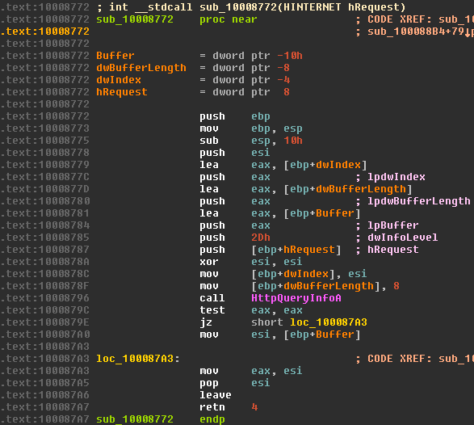
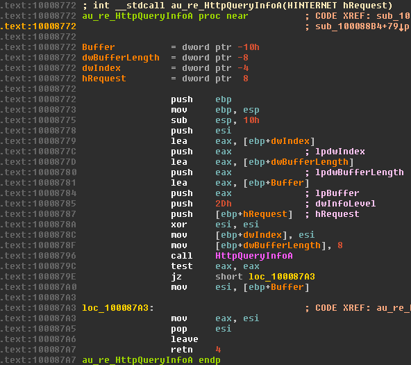
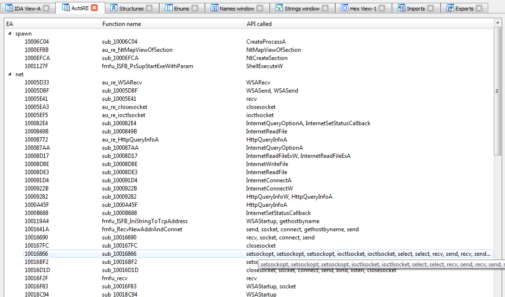
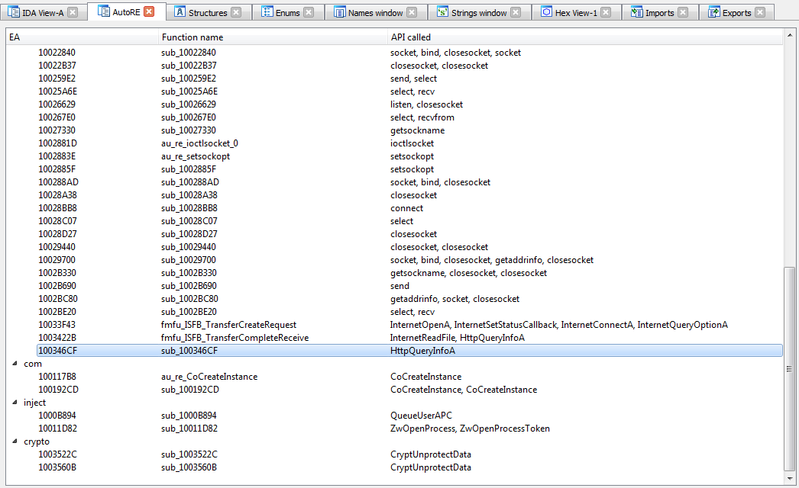
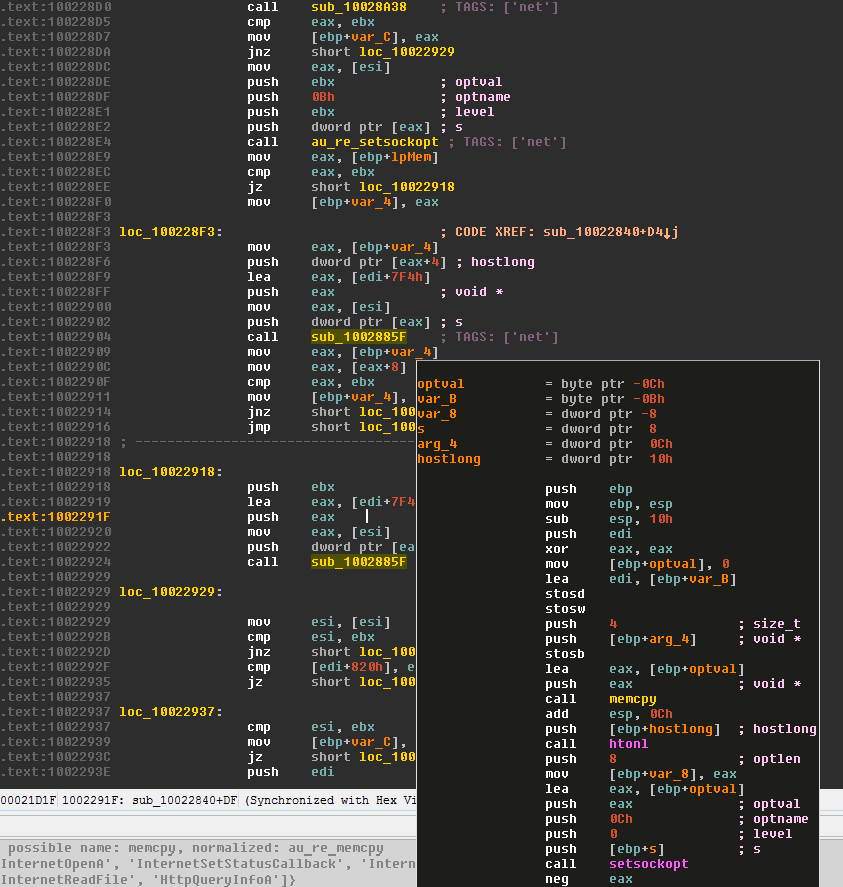
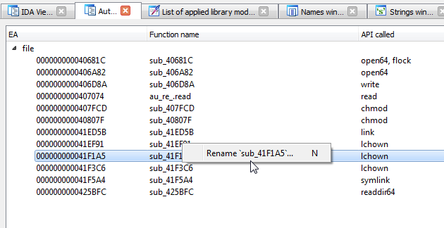

Features
========

## 1. Auto-renaming dummy-named functions, which have one API call or jump to the imported API

### Before

### After

## 2. Assigning TAGS to functions accordingly to called API-indicators inside

* Sets tags as repeatable function comments and displays TAG tree in the separate view

Some screenshots of TAGS view:

How TAGs look in unexplored code:

You can easily rename function using its context menu or just pressing `n` hotkey:

# Installation

Just copy `auto_re.py` to the `IDA\plugins` directory and it will be available through `Edit -> Plugins -> Auto RE` menu